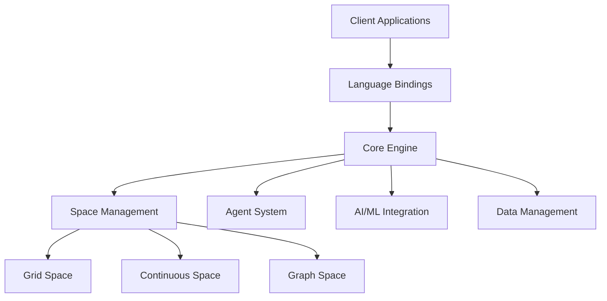
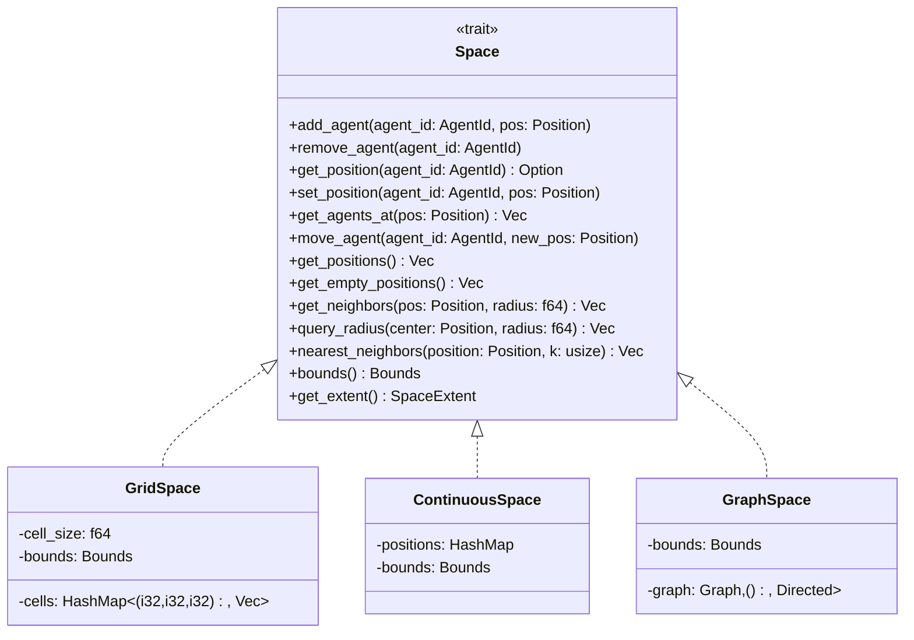
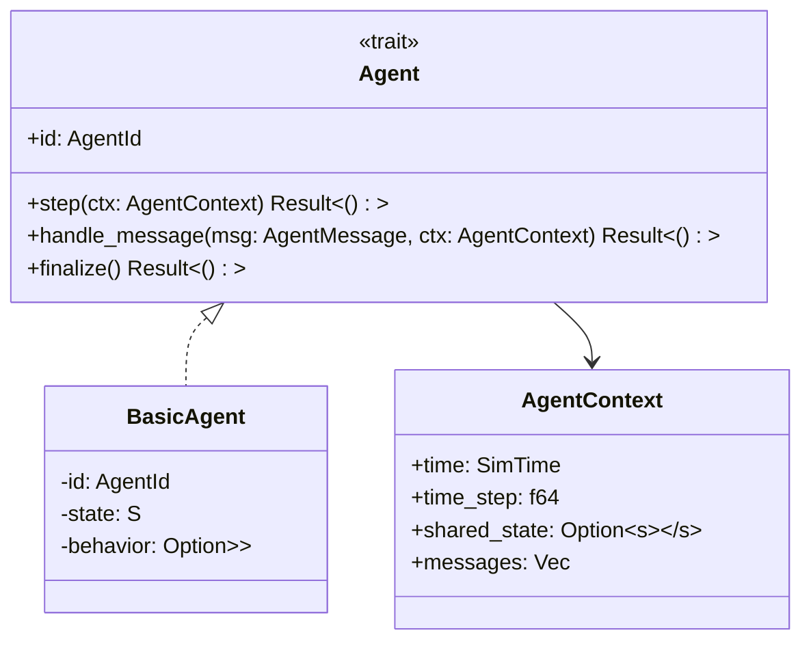
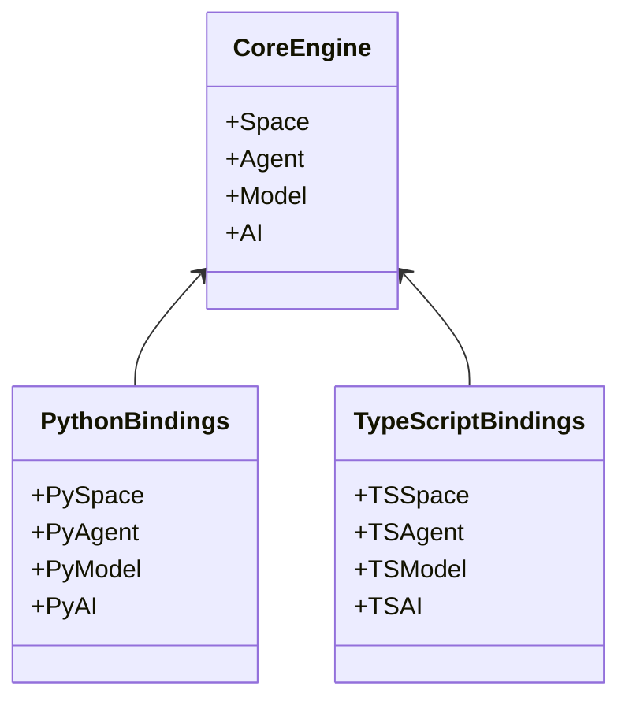
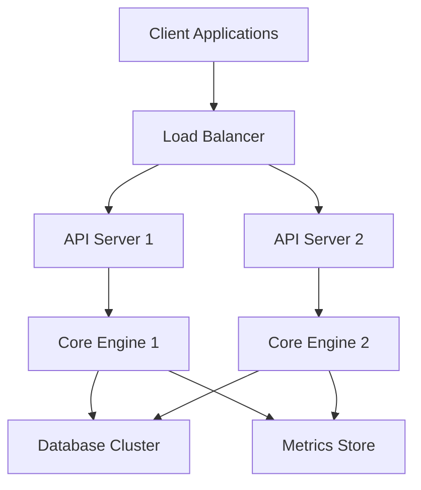
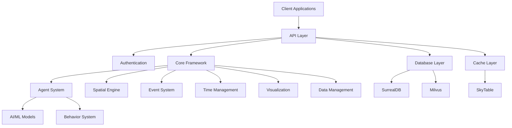
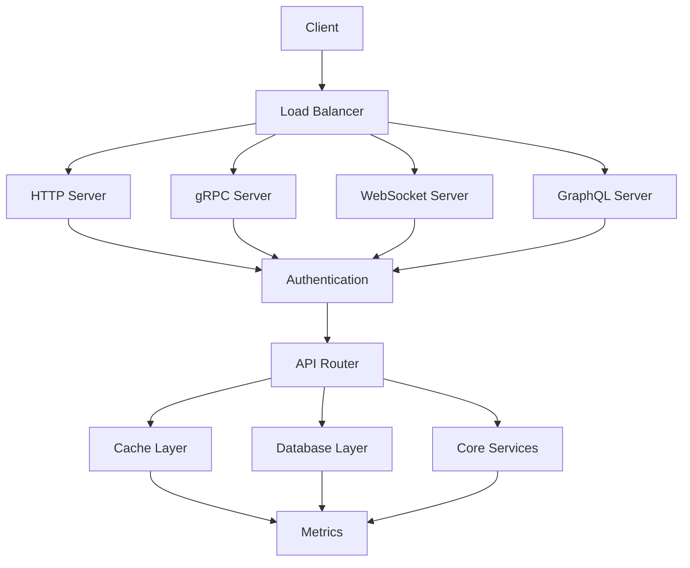
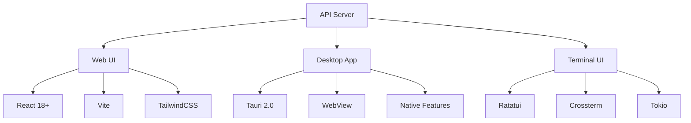

# GaussTwin Architecture

## Crate Tiers (v0.x consolidation)

The workspace is consolidated into a **minimum-viable product (MVP) surface** plus an
opt-in **breadth** tier. The Cargo `default-members` are the MVP crates, so bare
`cargo build` / `cargo test` / `cargo clippy` operate on the MVP and skip the heavy
long tail; the full set is still built and tested via `--workspace` (and in CI).

**MVP — the v0.x simulation + serving surface (`default-members`):**

| Crate | Role |
|---|---|
| `gausstwin-core` | agents, spaces, scheduler, model, events, time |
| `gausstwin-spaces` | grid/continuous/graph spaces, spatial indices, pathfinding |
| `gausstwin-des` | discrete-event simulation (scheduling, checkpoint/rollback) |
| `gausstwin-fsm` | finite state machines + system dynamics |
| `gausstwin-agent` | BDI / cognitive / reactive agent architectures |
| `gausstwin-api` | REST / GraphQL / gRPC / WebSocket serving |
| `gausstwin-ir` | GaussIR typed IR + deterministic validators (the "certified compilation" gate) |
| `gausstwin-cli` | command-line entry point |

> The MVP transitively pulls the data/serving plane (`gausstwin-{data,db,vec,ai,visual}`)
> through `api`/`agent`. Decoupling those from `api` via features is a tracked follow-up.

**Breadth — opt-in, built only via `--workspace` (not in `default-members`):**

| Crate | Why it's opt-in |
|---|---|
| `gausstwin-integration` | 13 protocol connectors (`rdkafka`+SASL, `scylla`, `ethers`, `sqlx`, `mongodb`, AWS/Azure, `zenoh`, …) — heaviest deps + largest supply-chain surface. Per-connector feature-gating is the next consolidation step. |
| `gausstwin-cosim` | FMI 2.0 / HLA co-simulation; needs real FMU/RTI infrastructure to exercise fully. |

Speculative `gausstwin-core` modules (`gpu`, `quantum`, `blockchain`, `distributed`,
`hpc`) are already feature-gated and off by default (see that crate's `[features]`).

## System Overview

## Core Components

### Space Management System
The space management system provides a unified interface for different types of spatial environments:

### Agent System
The agent system manages agent lifecycle and behavior:

### Language Bindings
The system provides native bindings for multiple languages:

## Performance Optimizations

### Space Partitioning
- Grid space uses cell-based partitioning for O(1) lookup
- Continuous space uses spatial hashing for O(log n) neighbor search
- Graph space uses adjacency lists for O(1) neighbor access

### Memory Management
- Efficient use of Rust's ownership system
- Minimal heap allocations
- Cache-friendly data structures

### Concurrency
- Thread-safe agent updates
- Async/await support
- Lock-free data structures where possible

## Current Implementation Status

### Completed Features
- Core space management system
- Basic agent framework
- Python bindings with numpy integration
- TypeScript bindings with WASM support
- Grid, continuous, and graph space implementations
- Basic metrics and monitoring

### In Progress
- Advanced AI/ML integration
- Distributed computing support
- Advanced visualization capabilities
- Real-time data streaming
- Performance profiling tools

### Planned Features
- GPU acceleration
- Quantum algorithm integration
- Advanced neural agents
- Blockchain integration
- Extended visualization tools

## Monitoring and Metrics

### System Metrics
- CPU usage per component
- Memory allocation patterns
- Network I/O throughput
- Operation latencies

### Business Metrics
- Agent population statistics
- Interaction frequencies
- State distributions
- Custom metrics

## Deployment Architecture

## Architecture Principles

1. **High Performance**
   - Lock-free concurrency
   - Vectorized operations
   - Memory pooling
   - SIMD optimizations

2. **Scalability**
   - Horizontal scaling
   - Distributed computing
   - Load balancing
   - Resource management

3. **Reliability**
   - Error handling
   - Fault tolerance
   - Data consistency
   - Transaction management

4. **Security**
   - Authentication
   - Authorization
   - Encryption
   - Audit logging

5. **Extensibility**
   - Plugin system
   - Custom agents
   - Integration points
   - API extensibility

## System Components

## API Server Architecture

## Data Flow

1. **Request Flow**
   - Client request
   - Authentication & authorization
   - Request validation
   - Rate limiting
   - Request processing
   - Response generation
   - Metrics collection

2. **Data Flow**
   - Data ingestion
   - Validation & transformation
   - Processing & analysis
   - Storage & caching
   - Query & retrieval
   - Export & visualization

3. **Event Flow**
   - Event generation
   - Event routing
   - Event processing
   - State updates
   - Notifications
   - Logging & monitoring

## Security Model

1. **Authentication**
   - JWT-based authentication
   - Token management
   - Session handling
   - Password hashing (Argon2)

2. **Authorization**
   - Role-based access control
   - Permission management
   - Resource ownership
   - Access policies

3. **Data Security**
   - Encryption at rest
   - Encryption in transit
   - Secure key management
   - Data isolation

## Performance Characteristics

1. **Latency Targets**
   - API requests: < 100ms
   - Real-time updates: < 50ms
   - Batch processing: < 1s
   - Query response: < 200ms

2. **Throughput**
   - HTTP: 10K+ requests/sec
   - gRPC: 50K+ requests/sec
   - WebSocket: 100K+ connections
   - Events: 1M+ events/sec

3. **Scalability**
   - Horizontal scaling
   - Auto-scaling
   - Load distribution
   - Resource optimization

## Monitoring & Observability

1. **Metrics**
   - System metrics
   - Application metrics
   - Business metrics
   - Custom metrics

2. **Logging**
   - Application logs
   - Access logs
   - Error logs
   - Audit logs

3. **Tracing**
   - Request tracing
   - Performance tracing
   - Error tracing
   - Distributed tracing

## Deployment Model

1. **Containerization**
   - Docker containers
   - Kubernetes orchestration
   - Service mesh
   - Auto-scaling

2. **Configuration**
   - Environment-based
   - External configuration
   - Secret management
   - Feature flags

3. **CI/CD**
   - Automated testing
   - Continuous integration
   - Continuous deployment
   - Release management

## Integration Points

1. **External Systems**
   - REST APIs
   - gRPC services
   - Message queues
   - Event streams

2. **Data Sources**
   - Databases
   - File systems
   - Streaming data
   - External APIs

3. **Visualization**
   - Dashboards
   - Reports
   - Real-time views
   - Export formats

## User Interface Architecture

### Multi-Platform UI Strategy

GaussTwin provides three user interface options to accommodate different use cases:

### Web UI (`ui/web/`)

Modern React-based single-page application:

- **Framework**: React 18+ with TypeScript
- **Build Tool**: Vite for fast development
- **Styling**: TailwindCSS + shadcn/ui components
- **State**: Zustand for global state, React Query for server state
- **Routing**: React Router v6
- **Charts**: Recharts + Three.js for 3D visualization
- **i18n**: react-i18next for internationalization

### Desktop App (`ui/desktop/`)

Native cross-platform application using Tauri 2.0:

- **Backend**: Rust with native OS integration
- **Frontend**: Shared WebUI codebase
- **Features**:
  - System tray with background operation
  - Native menus and keyboard shortcuts
  - File system integration
  - SQLite for local storage
  - Secure credential management (keyring)
  - Auto-updater support
- **Platforms**: Windows, macOS, Linux

### Terminal UI (`ui/tui/`)

Feature-rich terminal interface:

- **Framework**: Ratatui with Crossterm backend
- **Runtime**: Tokio async runtime
- **Views**:
  - Dashboard with sparklines and gauges
  - Simulation management
  - Agent inspection
  - Space visualization (ASCII canvas)
  - Log viewer with filtering
  - Metrics dashboard
- **Features**:
  - Command palette (Ctrl+P)
  - Vim-style navigation
  - Multiple themes (Tokyo Night, Gruvbox, Nord)
  - Full keyboard control

### UI Communication

All UIs communicate with the backend through:

1. **REST API**: Standard CRUD operations
2. **GraphQL**: Complex queries and mutations
3. **WebSocket**: Real-time updates and streaming
4. **gRPC**: High-performance binary protocol (Desktop/TUI)

## Future Extensions

1. **Planned Features**
   - Advanced AI capabilities
   - Enhanced visualization
   - Additional protocols
   - Performance optimizations

2. **Integration Plans**
   - Cloud providers
   - IoT platforms
   - Analytics services
   - Security services